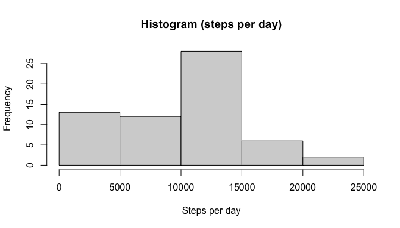
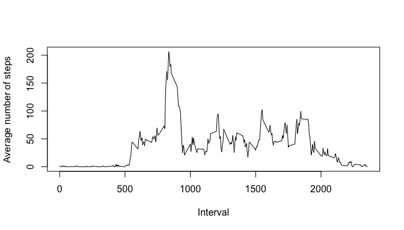
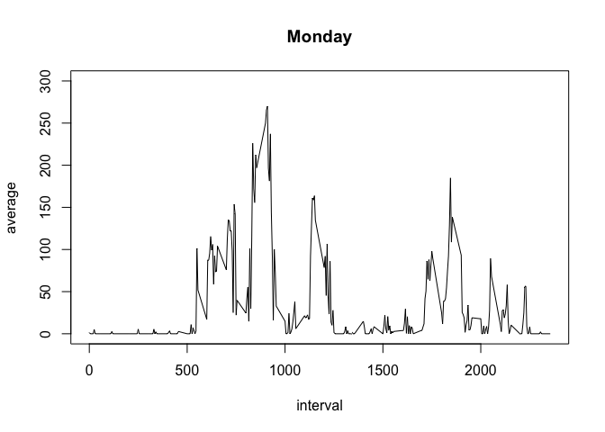
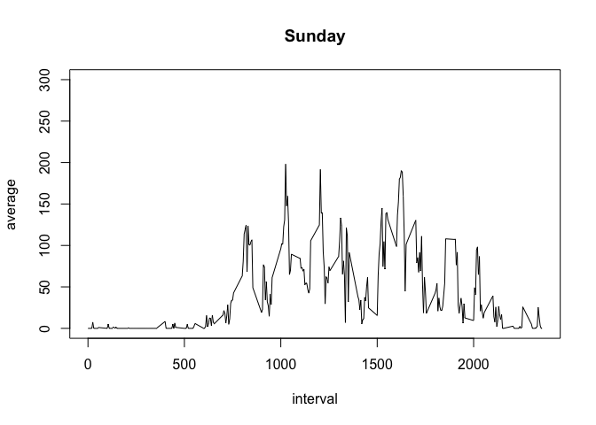
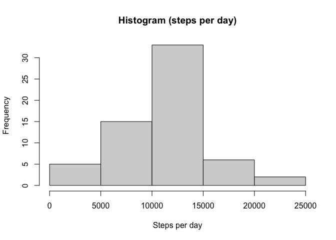
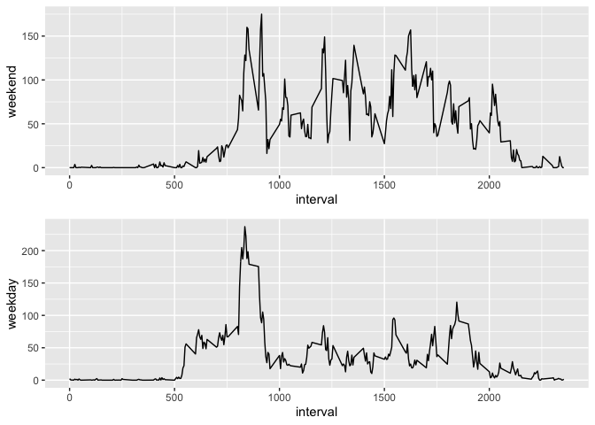

# Project Assignment 1, Reproducible Research course

This report is created for the porpoise of completing the project assignment for week 2
of Reproducible Research course.

The goal of the project is to analyze data captured from a personal activity monitoring device
that collected information every 5 minutes on the number of steps taken by a participant. Data was
collected for 2 months in October and November, 2012.

## Loading and pre-processing the data

1. Load the data (i.e. read.csv())

2. Process/transform the data (if necessary) into a format suitable for your analysis

Data for analysis is in the activity.csv file, downloaded from the project assignment description
at the coursera web page. The information is submitted by date, interval and number of steps.

All data is store in a dataframe object, steps and interval variables are integer, date is character
variable. The variable date is transformed onto a date type.


```r
data_raw <- read.csv("activity.csv")
data_raw$date <- as.Date(data_raw$date)
```

## What is mean total number of steps taken per day?

For this part of the assignment, you can ignore the missing values in the dataset.

1. Make a histogram of the total number of steps taken each day

2. Calculate and report the mean and median total number of steps taken per day

First part of the assignment is to calculate steps per day, mean and median. The following code does
the calculations and plot a histogram of total steps per day. For this instance, all missing data
will be ignored.


```r
steps_day <- with(data_raw, tapply(steps, date, sum, na.rm = TRUE))
resp <- summary(steps_day)
m1 <- resp[["Mean"]]
m1
```

```
## [1] 9354.23
```

```r
md1 <- resp[["Median"]]
md1
```

```
## [1] 10395
```

Histogram of steps per day:


```r
hist(steps_day, xlab = "Steps per day", main = "Histogram (steps per day)")
```

<!-- -->

## What is the average daily activity pattern?

1. Make a time series plot (i.e. type = "l") of the 5-minute interval (x-axis) and the average number of steps taken, averaged across all days (y-axis)

2. Which 5-minute interval, on average across all the days in the dataset, contains the maximum number of steps?

Average daily activity, the following code calculates the average amount of steps taken
per interval during the day, plots the results on a time series chart, and determines 
the interval of the day on average with the maximum number of steps. 

Calculates average number of steps per interval and stores it in a data frame:


```r
library('tibble')
per_interval <- with(data_raw, tapply(steps, interval, mean, na.rm = TRUE))
per_interval <- enframe(per_interval)
names(per_interval) <- c("interval","average")
```

In order to make the time series plot, it is needed to convert the interval variable onto
a POSIXct type. First, transform interval from character to integer, then change to a format
of 4 digits with 0s to fill using sprintf() function this will convert it back to character, 
then convert the result to a POSIXct type using strptime() and change the format to H:M. The
result will give a character variable, last action is to transform interval to POSIXct with
as.POSIXct() function.


```r
per_interval$interval <- as.integer(per_interval$interval)
```

Plot the average number of steps per interval during the day:


```r
with(per_interval, plot(interval, average, type = "l", ylab = "Average number of steps", xlab = "Interval"))
```

<!-- -->

Which interval on average has the maximun number of steps.

Interval:


```r
per_interval$interval[which(max(per_interval$average) == per_interval$average)]
```

```
## [1] 835
```

## Imputing missing values

Note that there are a number of days/intervals where there are missing values (coded as NA). The presence of missing days may introduce bias into some calculations or summaries of the data.

1. Calculate and report the total number of missing values in the dataset (i.e. the total number of rows with NAs)

2. Devise a strategy for filling in all of the missing values in the dataset. The strategy does not need to be sophisticated. For example, you could use the mean/median for that day, or the mean for that 5-minute interval, etc.

3. Create a new dataset that is equal to the original dataset but with the missing data filled in.

4. Make a histogram of the total number of steps taken each day and Calculate and report the mean and median total number of steps taken per day. Do these values differ from the estimates from the first part of the assignment? What is the impact of imputing missing data on the estimates of the total daily number of steps?

Start with defining how many missing values exist in the original database.

Calculate the number of missing values (NAs) in the steps variable:


```r
missing_steps <- is.na(data_raw$steps)
sum(missing_steps)
```

```
## [1] 2304
```

Now we determine which daters have these NAs are contained and the days of the week:


```r
list_missing <- which(is.na(data_raw$steps))
dates_missing <- unique(data_raw$date[list_missing])
dates_missing
```

```
## [1] "2012-10-01" "2012-10-08" "2012-11-01" "2012-11-04" "2012-11-09"
## [6] "2012-11-10" "2012-11-14" "2012-11-30"
```

```r
days_missing <- weekdays(dates_missing)
```

Missing data is on almost every day of the week except for Tuesday, note that daily patterns
vary during the week, as it shown in the following chart comparing Monday and Sunday:


```r
y <- subset(data_raw, weekdays(date) == "Monday")
Monday_per_interval <- enframe(with(y, tapply(steps, interval, mean, na.rm = TRUE)))
names(Monday_per_interval) <- c("interval","average")
y <- subset(data_raw, weekdays(date) == "Sunday")
Sunday_per_interval <- enframe(with(y, tapply(steps, interval, mean, na.rm = TRUE)))
names(Sunday_per_interval) <- c("interval","average")
Monday_per_interval$interval <- per_interval$interval
Sunday_per_interval$interval <- per_interval$interval
with(Monday_per_interval, plot(interval,average, type = "l", main = "Monday", ylim = c(0, 300)))
```

<!-- -->

```r
with(Sunday_per_interval, plot(interval,average, type = "l", main = "Sunday", ylim = c(0, 300)))
```

<!-- -->


Strategy:
In order to have an accurate imputing of data, we will use the interval average for the weekdays
of the missing data. 

Create a new database by copying the original, then assign values to missing data:


```r
data_full <- data_raw
for (i in (1:length(dates_missing))) {
        y <- subset(data_raw, weekdays(date) == weekdays(dates_missing[i]))
        range_date <- with(data_raw, which(date == dates_missing[i]))
        data_full$steps[range_date] <- with(y, tapply(steps, interval, mean, na.rm = TRUE))
}
```

We now view how the data looks now, the following code creates a histogram plot of the total
steps per day:


```r
steps_day <- with(data_full, tapply(steps, date, sum, na.rm = TRUE))
resp <- summary(steps_day)
hist(steps_day, xlab = "Steps per day", main = "Histogram (steps per day)")
```

<!-- -->

Report mean and median of total number of steps per day:


```r
resp <- summary(steps_day)
m2 <- resp[["Mean"]]
m2
```

```
## [1] 10821.21
```

```r
md2 <- resp[["Median"]]
md2
```

```
## [1] 11015
```

The impact of imputing data is shown as the difference of mean and median, as follows:


```r
sprintf("Mean difference: %2.1f%% ", 100*(m2-m1)/m1)
```

```
## [1] "Mean difference: 15.7% "
```

```r
sprintf("Median difference: %2.1f%% ", 100*(md2-md1)/md1)
```

```
## [1] "Median difference: 6.0% "
```

The impact of imputing missing values is an increase on the total number of steps per day,
reflected on mean and median as shown above.

#Are there differences in activity patterns between weekdays and weekends?

For this part the weekdays() function may be of some help here. Use the dataset with the filled-in missing values for this part.

1. Create a new factor variable in the dataset with two levels -- "weekday" and "weekend" indicating whether a 
given date is a weekday or weekend day.

2. Make a panel plot containing a time series plot (i.e. type = "l") of the 5-minute interval (x-axis) and the 
average number of steps taken, averaged across all weekday days or weekend days (y-axis). The plot should look 
something like the following, which was created using simulated data:

Activity patterns between weekdays and weekends, to realize the difference, we now 
create an extra factor variable named f.days to indicate whether the date is weekday 
or weekend.


```r
days_week <- weekdays(data_full$date)
days_in_weekend <- c("Saturday", "Sunday")
days_bin <- days_week %in% days_in_weekend
f.days <- factor(days_bin, levels = c("TRUE","FALSE"), labels = c("weekend","weekday"))
data_full$f.days <- f.days
summary(data_full)
```

```
##      steps             date               interval          f.days     
##  Min.   :  0.00   Min.   :2012-10-01   Min.   :   0.0   weekend: 4608  
##  1st Qu.:  0.00   1st Qu.:2012-10-16   1st Qu.: 588.8   weekday:12960  
##  Median :  0.00   Median :2012-10-31   Median :1177.5                  
##  Mean   : 37.57   Mean   :2012-10-31   Mean   :1177.5                  
##  3rd Qu.: 19.04   3rd Qu.:2012-11-15   3rd Qu.:1766.2                  
##  Max.   :806.00   Max.   :2012-11-30   Max.   :2355.0
```

Plot average number of steps taken across all weekend and weekdays


```r
data_weekend <- subset(data_full, f.days == "weekend")
plot_info1 <- enframe(with(data_weekend, tapply(steps, interval, mean)))
names(plot_info1) <- c("interval","weekend")
data_weekday <- subset(data_full, f.days == "weekday")
plot_info2 <- enframe(with(data_weekday, tapply(steps, interval, mean)))
names(plot_info2) <- c("interval","weekday")
plot_info1$weekday <- plot_info2$weekday
plot_info1$interval <- as.numeric(plot_info1$interval)
library("ggplot2")
library("gridExtra")
p1 <- qplot(interval, weekend, data = plot_info1, geom = "line") + scale_x_continuous(breaks = seq(0,2355, 500))
p2 <- qplot(interval, weekday, data = plot_info1, geom = "line")+ scale_x_continuous(breaks = seq(0,2355, 500))
grid.arrange(p1,p2,nrow=2)
```

<!-- -->


